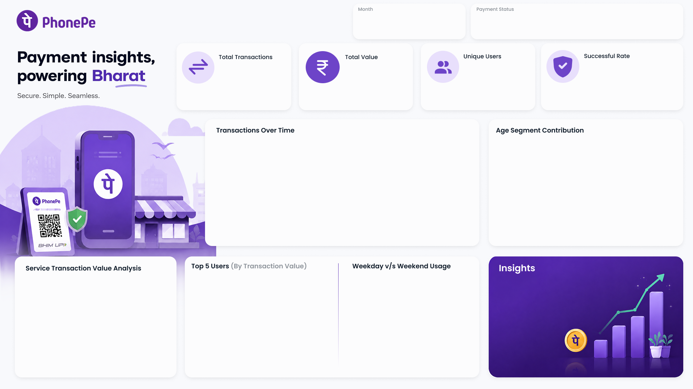

# 📊 PhonePe Transaction Analytics Dashboard | Power BI



> An end-to-end Business Intelligence project built using **Power BI**, **Python (Pandas)**, **Excel**, **Power Query**, and **DAX** to analyze large-scale digital payment transactions and generate actionable business insights.

---

# 🚀 Project Overview

This project demonstrates the complete Business Intelligence workflow by transforming raw transactional data into meaningful insights through:

- Data Modeling
- Data Cleaning
- Feature Engineering
- DAX Calculations
- Interactive Dashboard Development

The dashboard enables users to explore customer behavior, payment trends, service usage, revenue distribution, and overall business performance.

---

# 📂 Dataset Information

The source data consists of an Excel workbook containing **two related sheets**.

| Dataset | Records |
|----------|---------:|
| 👤 Users | **100,000+** |
| 💳 Transactions | **250,000+** |

After merging both datasets using **User_ID**, a unified analytical dataset was created for Power BI.

---

# 📋 Dataset Structure

## 👤 Users Table

| Column |
|---------|
| User_ID |
| Name |
| Age |
| Join_Date |

---

## 💳 Transactions Table

| Column |
|---------|
| Transaction_ID |
| User_ID |
| Amount |
| Service |
| Service Type |
| Payment_Status |
| Reason |
| Date |

---

# 🏗 Data Model

The Power BI data model consists of four tables:

- 👤 Users Table
- 💳 Transactions Table
- 📅 Date Table
- 📊 Measure Table

Relationships:

```
Users (1)
      │
      │ User_ID
      ▼
Transactions (*)
      ▲
      │ Date
      │
Date Table (1)
```

The **Users** table is connected to the **Transactions** table through **User_ID**, while the **Date Table** is connected through the **Transaction Date** column.

---

# 📅 Date Table

A dedicated **Date Dimension Table** was created using **DAX** to enable efficient time intelligence and dynamic reporting.

The Date Table includes:

- Year
- Month Number
- Month Name
- Quarter
- Weekday
- Day Number
- Weekend Indicator

This allows accurate monthly, quarterly, and yearly analysis throughout the dashboard.

---

# 📊 Measure Table

A separate **Measure Table** was created to organize all DAX measures in one place, making the data model clean, scalable, and easier to maintain.

The Measure Table contains measures such as:

- Total Revenue
- Total Transactions
- Total Customers
- Average Transaction Amount
- Successful Transactions
- Failed Transactions
- Success Rate
- High Value Transactions
- Monthly Revenue
- Revenue Growth
- Average Customer Spend

---

# ⚙ Data Preparation

Before importing the data into Power BI, preprocessing was performed using **Python (Pandas)**.

The workflow included:

- Merging Users and Transactions datasets
- Data Cleaning
- Removing duplicate records
- Converting date columns into datetime format
- Feature Engineering
- Exporting the final analytical dataset

---

# 🧠 Feature Engineering

The following business-oriented features were created:

- ✅ Age Group
- ✅ Month
- ✅ Month Name
- ✅ Transaction Year
- ✅ Quarter
- ✅ Day Name
- ✅ Weekend / Weekday
- ✅ High Value Transaction
- ✅ Amount Category
- ✅ Lifetime Spending
- ✅ Transaction Count
- ✅ Average Transaction Amount
- ✅ Maximum Transaction Amount
- ✅ Service Frequency
- ✅ Success Rate
- ✅ Failed Transaction Count

These engineered features provide deeper customer insights and improve analytical capabilities.

---

# 📈 Dashboard KPIs

The dashboard provides interactive KPIs including:

- 💰 Total Revenue
- 👥 Total Customers
- 💳 Total Transactions
- 📊 Average Transaction Amount
- ✅ Successful Transactions
- ❌ Failed Transactions
- 💵 High Value Transactions
- 📈 Success Rate
- 📅 Monthly Revenue
- 📊 Quarterly Revenue

---

# 📊 Dashboard Features

The Power BI dashboard includes:

- Executive KPI Cards
- Revenue Trend Analysis
- Monthly Sales Analysis
- Quarterly Analysis
- Service-wise Revenue
- Service Type Distribution
- Payment Status Analysis
- Customer Age Group Analysis
- Weekend vs Weekday Analysis
- High Value Transaction Analysis
- Interactive Filters
- Drill-through Reports
- Dynamic Slicers
- Custom Tooltips

---

# 📌 Business Insights

The dashboard answers important business questions such as:

- Which services generate the highest revenue?
- Which service type is used most frequently?
- Which age group performs the highest number of transactions?
- Which months experience peak transaction activity?
- How does weekend activity compare with weekdays?
- What percentage of transactions are successful?
- Who are the highest spending customers?
- How are customers distributed across spending categories?

---

# 🛠 Tools & Technologies

| Technology | Purpose |
|------------|----------|
| Power BI | Dashboard Development |
| Python | Data Cleaning & Feature Engineering |
| Pandas | Data Manipulation |
| Microsoft Excel | Data Source |
| Power Query | Data Transformation |
| DAX | Measures & Calculated Tables |

---

# 📂 Repository Structure

```
PhonePe-Transaction-Analytics/
│
├── 📊 phone_pe.pbix
├── 📄 Phonepe-Final-Dataset.xlsx
├── 🖼️ Background.png
├── 🖼️ phonepelogo.png
├── 🖼️ calendar-icon.png
├── 📄 README.md
└── 📄 LICENSE
```

---

# 📸 Dashboard Preview

## Dashboard Overview


```


```

---

# 💼 Skills Demonstrated

- Data Cleaning
- Data Modeling
- Feature Engineering
- Data Analysis
- Power Query
- DAX
- Business Intelligence
- Dashboard Development
- KPI Design
- Data Visualization
- Customer Analytics
- Time Intelligence
- Report Optimization

---

# 🎯 Project Outcomes

This project demonstrates the ability to:

- Design scalable Power BI data models
- Integrate multiple datasets
- Perform feature engineering using Python
- Build reusable DAX measures
- Create interactive dashboards
- Analyze customer behavior
- Generate business insights from transactional data
- Apply Business Intelligence best practices

---

# 📜 License

This project is licensed under the **MIT License**.

---

# ⭐ Support

If you found this project useful, consider giving this repository a ⭐ on GitHub.

---

## 👩‍💻 Author

**Sai Chetan**

Computer Science Engineer | Data Analyst | Power BI Developer

Passionate about transforming raw data into meaningful business insights through analytics and visualization.
